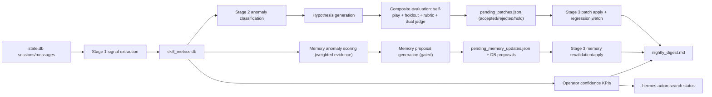

# Autoresearch Measurement-Fidelity Upgrade

**Status:** Implemented  
**Audience:** Engineers new to Hermes, autoresearch, and evaluation systems  
**Scope:** Stage 1/2/3 fidelity upgrades, memory contradiction precision, and operator confidence reporting

---

## 1) What This Upgrade Is

This upgrade raises the quality of Hermes autoresearch decisions by improving how outcomes are measured, attributed, validated, and reported.

Before this change, Stage 2 mainly relied on self-play deltas from the same model family and Stage 1 signal extraction was intentionally lightweight. That made decisions fast, but weaker against bias and harder to diagnose.

After this upgrade, the loop includes:

- richer Stage 1 session labels and attribution signals,
- deterministic multi-class anomaly detection,
- holdout replay evaluation and rubric checks,
- optional independent judge path (dual-judge),
- stronger memory contradiction scoring with suppression rules,
- explicit operator confidence KPIs in digest and CLI status.

The design goal is not "more patches." The goal is better patch quality with clearer evidence and safer automation.

---

## 2) Why This Was Needed

The core problem is **measurement fidelity**: if reward signals are noisy or biased, the loop can optimize the wrong thing.

Primary failure modes addressed:

- false attribution (blaming the wrong skill or memory source),
- same-model evaluation bias (generator judges itself),
- over-triggering anomalies from coarse thresholds,
- memory updates from ambiguous user language,
- poor operator visibility into whether accepted changes stay healthy.

This implementation adds enough structure to reduce those failure modes while preserving existing Stage 1/2/3 behavior and safety controls.

---

## 3) System Architecture (What Changed)

---

## 4) How It Works

## 4.1 Stage 1: Higher-Fidelity Signals + Attribution

Code:
- [cron/autoresearch/signal_extractor.py](/C:/Users/simon/.codex/worktrees/00d2/hermes-agent-tutorial/cron/autoresearch/signal_extractor.py)
- [cron/autoresearch/skill_metrics.py](/C:/Users/simon/.codex/worktrees/00d2/hermes-agent-tutorial/cron/autoresearch/skill_metrics.py)

### What changed

`session_signals` now records richer fields:

- `correction_labels` (e.g. `explicit_wrong`, `retry_request`, `misunderstanding`),
- `correction_intensity` (0..1),
- `completion_confidence` (0..1),
- `session_source`,
- `skill_attribution` (per-skill causal confidence map),
- `memory_attribution` (per-target overlap confidence map for built-in memory).

`skill_health` now aggregates:

- `avg_tool_calls`,
- `avg_correction_intensity`,
- `avg_completion_confidence`,
- `avg_skill_causal_confidence`.

### Why it matters

These fields make Stage 2 less dependent on single coarse signals and give better downstream explainability ("what likely caused the failure?").

### How attribution is computed

- Skill attribution combines correction intensity and keyword overlap between correction snippets and skill tokens.
- Memory attribution uses negation-aware overlap between correction snippets and current built-in memory entries.

This is still heuristic, but materially stronger than regex-only correction counting.

---

## 4.2 Stage 2: Evaluation Validity and Anomaly Coverage

Code:
- [cron/autoresearch/anomaly_detector.py](/C:/Users/simon/.codex/worktrees/00d2/hermes-agent-tutorial/cron/autoresearch/anomaly_detector.py)
- [cron/autoresearch/hypothesis_generator.py](/C:/Users/simon/.codex/worktrees/00d2/hermes-agent-tutorial/cron/autoresearch/hypothesis_generator.py)
- [cron/autoresearch/self_play_evaluator.py](/C:/Users/simon/.codex/worktrees/00d2/hermes-agent-tutorial/cron/autoresearch/self_play_evaluator.py)
- [cron/autoresearch/pending_patches.py](/C:/Users/simon/.codex/worktrees/00d2/hermes-agent-tutorial/cron/autoresearch/pending_patches.py)
- [cron/autoresearch/__init__.py](/C:/Users/simon/.codex/worktrees/00d2/hermes-agent-tutorial/cron/autoresearch/__init__.py)

### Multi-type anomalies

Stage 2 now classifies three deterministic anomaly classes:

- `UNDERPERFORMING`
- `STRUCTURALLY_BROKEN`
- `MISSING_COVERAGE`

Classification is mutually exclusive in this order:
1. `STRUCTURALLY_BROKEN`
2. `MISSING_COVERAGE`
3. `UNDERPERFORMING`

All three classes run through the same patch candidate and evaluation pipeline (auto-patch path remains enabled).

### Holdout replay and leakage control

For each skill anomaly, Stage 2 builds holdout tasks from recent session signals and stores them in `autoresearch_holdout_cases`.

Important guard:
- holdout builder excludes current candidate-generation excerpts (`exclude_texts`) to reduce data leakage between generation and evaluation sets.

Used holdout tasks are marked in DB for traceability.

### Composite evaluation gate

Each candidate now receives:

- self-play deltas,
- holdout deltas,
- deterministic rubric pass rates (old vs new),
- dual-judge disagreement signal (when independent judge is supplied).

Decision outcomes:

- `accepted`
- `rejected`
- `hold` (unresolved judge disagreement)

Acceptance requires all of:

- self-play efficiency gate (token delta improvement requirement),
- self-play quality non-degradation,
- holdout quality non-degradation (when holdout tasks exist),
- rubric pass rate not degraded (self-play and holdout),
- no unresolved dual-judge disagreement.

### Dual-judge design

- `llm_call` remains generation + primary scoring path.
- `judge_llm_call` is optional independent judging path.
- if omitted, legacy behavior is preserved and no synthetic disagreement is introduced.

---

## 4.3 Memory Contradiction Hardening

Code:
- [cron/autoresearch/memory_anomaly_detector.py](/C:/Users/simon/.codex/worktrees/00d2/hermes-agent-tutorial/cron/autoresearch/memory_anomaly_detector.py)
- [cron/autoresearch/memory_hypothesis_generator.py](/C:/Users/simon/.codex/worktrees/00d2/hermes-agent-tutorial/cron/autoresearch/memory_hypothesis_generator.py)
- [cron/autoresearch/memory_updater.py](/C:/Users/simon/.codex/worktrees/00d2/hermes-agent-tutorial/cron/autoresearch/memory_updater.py)

### Weighted contradiction evidence

Memory staleness is no longer count-only. Evidence is weighted by:

- recency weight,
- source weight (`session_source`),
- contradiction strength (strong negation > weak negation),
- lexical overlap with current memory entry.

Per-entry score is aggregated as:

`sum(overlap * recency_weight * source_weight * contradiction_strength)`

Proposal generation requires both:

- minimum evidence count,
- minimum weighted evidence score.

### Ambiguity suppression

Snippets are filtered out before scoring when they are likely ambiguous, including:

- hedged language (`maybe`, `might`, `not sure`, etc.),
- very low-specificity snippets,
- question-like uncertain snippets without contradiction markers.

This reduces destructive false positives from uncertain phrasing.

### Conservative apply behavior

Memory apply remains two-phase and conservative:

- propose first,
- revalidate on due run,
- apply only when still supported.

Ambiguous/no-match memory tool outcomes are routed to `needs_review` and never force-applied.

---

## 4.4 Stage 3 and Operator Reporting

Code:
- [cron/autoresearch/digest.py](/C:/Users/simon/.codex/worktrees/00d2/hermes-agent-tutorial/cron/autoresearch/digest.py)
- [hermes_cli/autoresearch.py](/C:/Users/simon/.codex/worktrees/00d2/hermes-agent-tutorial/hermes_cli/autoresearch.py)
- [cron/autoresearch/runner.py](/C:/Users/simon/.codex/worktrees/00d2/hermes-agent-tutorial/cron/autoresearch/runner.py)

### New KPI family (default 30-day window)

Computed in `get_operator_confidence_metrics(...)`:

- **Patch stability ratio**  
  `stable / (stable + rolled_back + needs_review)`

- **Acceptance-to-regression ratio**  
  `applied / max(rolled_back + needs_review, 1)`

- **Memory precision proxy**  
  `memory_applied / max(memory_applied + memory_needs_review + memory_failed, 1)`

- **Holdout pass rate**  
  `holdout_pass_eval_runs / total_eval_runs`

### Where KPIs are surfaced

- nightly digest section: `## Operator confidence`
- CLI status block: `operator confidence (30d)` in `hermes autoresearch status`

These metrics provide a rolling health signal for operators, not a one-run snapshot.

---

## 5) Public Interfaces and Contracts

## 5.1 Stage orchestration

`run_stage2(...)` now supports:

- `judge_llm_call: Optional[LlmCall] = None`
- `enable_holdout_eval: bool = True`
- `holdout_days: int = 30`
- `holdout_tasks_per_skill: int = 20`
- `enable_memory_updates: bool = True`
- `memory_min_confidence: float = 0.7`
- `memory_min_evidence: int = 2`
- `memory_min_evidence_score: float = 1.25`

`run_stage3(...)` includes:

- `run_memory_apply: bool = True`

`run_full_loop(...)` now threads holdout and judge parameters through Stage 2.

## 5.2 Evaluation result payload

`evaluate_candidate(...)` continues returning core fields, and now can include:

- `holdout_task_count`
- `holdout_token_delta`
- `holdout_quality_delta`
- `holdout_pass`
- `rubric_pass_rate_old`
- `rubric_pass_rate_new`
- `holdout_rubric_pass_rate_old`
- `holdout_rubric_pass_rate_new`
- `dual_judge_disagreement`
- `primary_quality_delta`
- `secondary_quality_delta`

These fields are propagated into `pending_patches.json` when present.

## 5.3 Database additions

New tables:

- `autoresearch_holdout_cases`
- `autoresearch_eval_runs`

Expanded tables:

- `session_signals` (labeling + attribution columns)
- `skill_health` (richer aggregated metrics)
- `autoresearch_memory_updates` (`evidence_score`)

Migrations are best-effort and additive via `_ensure_columns(...)`.

---

## 6) Safety and Backward Compatibility

### Safety controls

- no automatic external memory provider mutation,
- memory updates remain built-in file memory only,
- two-phase memory apply with revalidation,
- unresolved judge disagreements become `hold`,
- conservative fallback defaults for sparse or old rows.

### Backward compatibility

- existing Stage 1/2/3 paths remain valid without new optional parameters,
- old DB rows remain readable; missing fields are defaulted,
- extended evaluation fields are additive (not required for existing consumers).

---

## 7) Validation and Test Evidence

Primary test coverage for this upgrade includes:

- [tests/cron/test_anomaly_detector.py](/C:/Users/simon/.codex/worktrees/00d2/hermes-agent-tutorial/tests/cron/test_anomaly_detector.py)
- [tests/cron/test_self_play_evaluator.py](/C:/Users/simon/.codex/worktrees/00d2/hermes-agent-tutorial/tests/cron/test_self_play_evaluator.py)
- [tests/cron/test_skill_metrics.py](/C:/Users/simon/.codex/worktrees/00d2/hermes-agent-tutorial/tests/cron/test_skill_metrics.py)
- [tests/cron/test_digest.py](/C:/Users/simon/.codex/worktrees/00d2/hermes-agent-tutorial/tests/cron/test_digest.py)
- [tests/cron/test_autoresearch_stage2.py](/C:/Users/simon/.codex/worktrees/00d2/hermes-agent-tutorial/tests/cron/test_autoresearch_stage2.py)
- [tests/cron/test_runner.py](/C:/Users/simon/.codex/worktrees/00d2/hermes-agent-tutorial/tests/cron/test_runner.py)
- [tests/hermes_cli/test_autoresearch_cli.py](/C:/Users/simon/.codex/worktrees/00d2/hermes-agent-tutorial/tests/hermes_cli/test_autoresearch_cli.py)
- memory-specific coverage:
  - [tests/cron/test_memory_anomaly_detector.py](/C:/Users/simon/.codex/worktrees/00d2/hermes-agent-tutorial/tests/cron/test_memory_anomaly_detector.py)
  - [tests/cron/test_memory_hypothesis_generator.py](/C:/Users/simon/.codex/worktrees/00d2/hermes-agent-tutorial/tests/cron/test_memory_hypothesis_generator.py)
  - [tests/cron/test_memory_updater.py](/C:/Users/simon/.codex/worktrees/00d2/hermes-agent-tutorial/tests/cron/test_memory_updater.py)
  - [tests/cron/test_pending_memory_updates.py](/C:/Users/simon/.codex/worktrees/00d2/hermes-agent-tutorial/tests/cron/test_pending_memory_updates.py)
  - [tests/cron/test_autoresearch_stage3_memory.py](/C:/Users/simon/.codex/worktrees/00d2/hermes-agent-tutorial/tests/cron/test_autoresearch_stage3_memory.py)
  - [tests/integration/test_autoresearch_memory_e2e.py](/C:/Users/simon/.codex/worktrees/00d2/hermes-agent-tutorial/tests/integration/test_autoresearch_memory_e2e.py)

Execution note from current implementation cycle:

- Focused autoresearch subset: `177 passed`.
- Full `tests/cron` includes known Windows file-permission expectation failures in `test_file_permissions.py` (POSIX mode assertions), unrelated to autoresearch logic.

---

## 8) Operating the System

### Typical runtime

1. Stage 1 writes richer signals and skill health aggregates.
2. Stage 2 classifies anomalies, generates candidates, evaluates with composite gate, and writes pending artifacts.
3. Stage 3 applies accepted skill patches, processes due memory updates, runs regression watch, computes KPIs, writes digest.

### Operator entry points

- `hermes autoresearch status`
- `hermes autoresearch patches`
- `HERMES_HOME/autoresearch/nightly_digest.md`

Use KPI trends over time, not a single run, to decide threshold adjustments.

---

## 9) Known Limits and Next Calibration Work

This upgrade improves fidelity but does not eliminate all uncertainty.

Remaining data-dependent work:

- tune anomaly thresholds on production traffic,
- calibrate holdout/rubric strictness by skill category,
- improve attribution confidence using richer provenance signals,
- replace heuristic memory/source weighting with empirically learned weights when sufficient data is available.

The implementation intentionally stores enough structured data to support that calibration without redesigning the pipeline.

