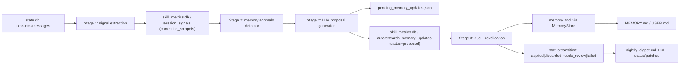

# Autoresearch Memory v1

**Status:** Production-ready v1  
**Audience:** Engineers new to Hermes, autoresearch, and the memory subsystem  
**Scope:** Built-in memory staleness detection and safe automated updates (`MEMORY.md`, `USER.md`)

---

## 1) What This System Is

Hermes has a nightly **autoresearch loop** with three stages:

1. Stage 1 observes behavior (signals from sessions).
2. Stage 2 proposes improvements.
3. Stage 3 applies safe improvements.

This document explains the memory-focused extension added to that loop:

- Detect likely stale facts in built-in memory files.
- Propose targeted updates (`replace` or `remove`).
- Apply updates safely using a **two-phase** flow:
  - **Run N:** propose only.
  - **Run N+1 (after 24h):** revalidate with fresh evidence, then apply.

The design is intentionally conservative. If confidence is weak or matching is ambiguous, the system does **not** force a write.

---

## 2) Why We Built It

Without this loop, built-in memory can drift from reality:

- user preferences change,
- environment facts become outdated,
- prior assumptions get corrected in conversation.

Drift causes repeated mistakes and higher correction load.

The v1 objective is to reduce stale-memory regressions while preserving safety:

- no blind edits,
- no external-provider mutation,
- full audit trail in DB and digest,
- operator visibility in CLI.

---

## 3) Core Product Decisions

### 3.1 In-scope

- Built-in file memory only:
  - `HERMES_HOME/memories/MEMORY.md`
  - `HERMES_HOME/memories/USER.md`
- Actions:
  - `replace`
  - `remove`

### 3.2 Out-of-scope (v1)

- External memory provider mutation.
- Automatic `add` action from staleness path.

### 3.3 Safety model

- Gated proposal generation:
  - minimum confidence,
  - minimum evidence count,
  - strict schema/action validation.
- Two-phase apply with 24h delay.
- Revalidation required at apply time.
- Ambiguous memory-tool matches become `needs_review`, not forced apply.

---

## 4) Architecture at a Glance



---

## 5) How It Works (End-to-End)

## 5.1 Stage 1: Capture Correction Context

File: [`cron/autoresearch/signal_extractor.py`](/C:/Users/simon/.codex/worktrees/00d2/hermes-agent-tutorial/cron/autoresearch/signal_extractor.py)

`extract_signals(...)` now stores:

- `correction_count`
- `correction_snippets` (short user text snippets that match correction patterns)

Why this matters: memory staleness needs concrete contradiction evidence, not just aggregate counts.

---

## 5.2 Stage 2: Detect + Propose (No Apply)

### 5.2.1 Detect stale candidates

File: [`cron/autoresearch/memory_anomaly_detector.py`](/C:/Users/simon/.codex/worktrees/00d2/hermes-agent-tutorial/cron/autoresearch/memory_anomaly_detector.py)

`detect_memory_anomalies(...)`:

1. Loads built-in memory entries from `MEMORY.md` and `USER.md`.
2. Normalizes entries (strips `[HIGH]` / `[EPHEMERAL ...]` prefixes).
3. Reads recent `correction_snippets` from `session_signals` (default 7 days).
4. Keeps snippets that contain negation/correction markers.
5. Computes token overlap between snippet and memory entry.
6. Emits anomaly only when evidence threshold is met.

Output per anomaly includes:

- `target` (`memory` or `user`)
- `old_text`
- `entry_text`
- `evidence_count`
- `evidence_snippets`
- `anomaly_type="STALE_MEMORY"`
- `trigger_metric="contradiction_evidence=<n>"`

### 5.2.2 Generate constrained update proposals

File: [`cron/autoresearch/memory_hypothesis_generator.py`](/C:/Users/simon/.codex/worktrees/00d2/hermes-agent-tutorial/cron/autoresearch/memory_hypothesis_generator.py)

`generate_memory_proposals(...)` prompts the LLM to return strict JSON:

- `action` in `{replace, remove}`
- `target` in `{memory, user}`
- `old_text`
- `content` (empty for `remove`)
- `reason`
- `confidence` in `[0,1]`

Normalization gates reject proposals when:

- action unsupported,
- target invalid,
- `old_text` is empty/unrelated to matched entry,
- `replace` has empty content,
- confidence below threshold,
- evidence below threshold.

Defaults:

- `min_confidence=0.7`
- `min_evidence=2`

### 5.2.3 Persist queue artifacts + DB rows

Files:

- [`cron/autoresearch/pending_memory_updates.py`](/C:/Users/simon/.codex/worktrees/00d2/hermes-agent-tutorial/cron/autoresearch/pending_memory_updates.py)
- [`cron/autoresearch/skill_metrics.py`](/C:/Users/simon/.codex/worktrees/00d2/hermes-agent-tutorial/cron/autoresearch/skill_metrics.py)
- [`cron/autoresearch/__init__.py`](/C:/Users/simon/.codex/worktrees/00d2/hermes-agent-tutorial/cron/autoresearch/__init__.py)

Stage 2 writes:

1. `HERMES_HOME/autoresearch/pending_memory_updates.json`
2. `autoresearch_memory_updates` rows in `skill_metrics.db` with:
   - `status='proposed'`
   - `first_seen_at`
   - `apply_after = first_seen_at + 24h`

Deduping behavior:

- open proposals are deduped by `(target, action, old_text, new_content)` and refreshed in place.

---

## 5.3 Stage 3: Revalidate + Apply (Two-Phase)

File: [`cron/autoresearch/memory_updater.py`](/C:/Users/simon/.codex/worktrees/00d2/hermes-agent-tutorial/cron/autoresearch/memory_updater.py)

`process_memory_updates(...)`:

1. Lists open proposals (`proposed`, `pending_revalidation`) for visibility.
2. Selects due rows where `apply_after <= now`.
3. Re-runs anomaly detection on fresh signals.
4. For each due row:
   - marks `pending_revalidation`,
   - verifies staleness signal is still present,
   - applies via `MemoryStore + memory_tool`.

Status transitions:

- `proposed -> pending_revalidation`
- then one of:
  - `applied`
  - `discarded` (signal no longer present)
  - `needs_review` (ambiguous/no match)
  - `failed` (other tool/runtime error)

Apply semantics:

- Memory mutation uses existing `tools/memory_tool.py`.
- If error text indicates ambiguous matching (`multiple entries matched`) or no match, status becomes `needs_review`.
- Injection/content-scan blocks and other failures become `failed`.

---

## 6) Public Interfaces and Data Contracts

## 6.1 Stage function signatures

File: [`cron/autoresearch/__init__.py`](/C:/Users/simon/.codex/worktrees/00d2/hermes-agent-tutorial/cron/autoresearch/__init__.py)

- `run_stage2(..., enable_memory_updates: bool = True, pending_memory_updates_path: Optional[Path] = None, memory_min_confidence: float = 0.7, memory_min_evidence: int = 2)`
- `run_stage3(..., run_memory_apply: bool = True)`

## 6.2 Pending artifact schema

Path:

- `HERMES_HOME/autoresearch/pending_memory_updates.json`

Each entry:

```json
{
  "target": "memory",
  "action": "replace",
  "old_text": "Always use branch main for deploy.",
  "content": "Use release branches for deploy.",
  "reason": "deploy policy changed",
  "confidence": 0.93,
  "evidence_count": 3,
  "trigger_metric": "contradiction_evidence=3",
  "generated_at": "2026-04-17T08:00:00Z"
}
```

## 6.3 DB schema

Table in `skill_metrics.db`:

- `autoresearch_memory_updates`

Columns:

- `id`
- `target`
- `action`
- `old_text`
- `new_content`
- `reason`
- `confidence`
- `evidence_count`
- `first_seen_at`
- `apply_after`
- `last_validated_at`
- `status`
- `applied_at`
- `error`

---

## 7) Operational Visibility

### 7.1 Nightly digest additions

File: [`cron/autoresearch/digest.py`](/C:/Users/simon/.codex/worktrees/00d2/hermes-agent-tutorial/cron/autoresearch/digest.py)

New sections:

- `Proposed memory`
- `Applied memory`
- `Needs review`

`Needs your attention` also includes memory `needs_review` and `failed` outcomes.

### 7.2 CLI additions

File: [`hermes_cli/autoresearch.py`](/C:/Users/simon/.codex/worktrees/00d2/hermes-agent-tutorial/hermes_cli/autoresearch.py)

- `hermes autoresearch status` now shows:
  - memory queue counts (`proposed`, `pending_revalidation`, `needs_review`)
  - memory outcome counts (`applied`, `discarded`, `failed`)
- `hermes autoresearch patches` now prints:
  - pending memory updates,
  - recent memory outcomes (with failure details when present).

---

## 8) Profile Safety and Path Resolution

Previously, stage orchestration could accidentally use global defaults when `hermes_home` was provided without explicit `metrics_db_path` / `patches_path` / `digest_path`.

This was fixed in [`cron/autoresearch/__init__.py`](/C:/Users/simon/.codex/worktrees/00d2/hermes-agent-tutorial/cron/autoresearch/__init__.py):

- Stage 1/2/3 now resolve default paths from the effective `hermes_home`.
- This prevents cross-profile leakage in multi-profile environments.

---

## 9) Failure Modes and Expected Behavior

| Scenario | Outcome |
|---|---|
| Weak evidence | no proposal emitted |
| Low confidence proposal | dropped before queue |
| Due proposal, signal disappeared | `discarded` |
| Multiple matches for `old_text` | `needs_review` |
| No entry match | `needs_review` |
| Content blocked by memory security scan | `failed` |
| Non-JSON tool output | `failed` |

Design principle: when uncertain, avoid mutation.

---

## 10) Testing Strategy and Evidence

### Unit coverage

- anomaly detection:
  - [`tests/cron/test_memory_anomaly_detector.py`](/C:/Users/simon/.codex/worktrees/00d2/hermes-agent-tutorial/tests/cron/test_memory_anomaly_detector.py)
- proposal validation/gating:
  - [`tests/cron/test_memory_hypothesis_generator.py`](/C:/Users/simon/.codex/worktrees/00d2/hermes-agent-tutorial/tests/cron/test_memory_hypothesis_generator.py)
- artifact I/O:
  - [`tests/cron/test_pending_memory_updates.py`](/C:/Users/simon/.codex/worktrees/00d2/hermes-agent-tutorial/tests/cron/test_pending_memory_updates.py)
- apply/revalidation lifecycle:
  - [`tests/cron/test_memory_updater.py`](/C:/Users/simon/.codex/worktrees/00d2/hermes-agent-tutorial/tests/cron/test_memory_updater.py)
- DB lifecycle/idempotency:
  - [`tests/cron/test_skill_metrics.py`](/C:/Users/simon/.codex/worktrees/00d2/hermes-agent-tutorial/tests/cron/test_skill_metrics.py)
- digest formatting:
  - [`tests/cron/test_digest.py`](/C:/Users/simon/.codex/worktrees/00d2/hermes-agent-tutorial/tests/cron/test_digest.py)

### Stage/integration coverage

- stage wiring:
  - [`tests/cron/test_autoresearch_stage2.py`](/C:/Users/simon/.codex/worktrees/00d2/hermes-agent-tutorial/tests/cron/test_autoresearch_stage2.py)
  - [`tests/cron/test_autoresearch_stage3_memory.py`](/C:/Users/simon/.codex/worktrees/00d2/hermes-agent-tutorial/tests/cron/test_autoresearch_stage3_memory.py)
- end-to-end:
  - [`tests/integration/test_autoresearch_memory_e2e.py`](/C:/Users/simon/.codex/worktrees/00d2/hermes-agent-tutorial/tests/integration/test_autoresearch_memory_e2e.py)

Validated scenarios include:

- run N propose only,
- run N+1 revalidate then apply,
- mixed skill patch + memory proposal path,
- profile-path behavior via `HERMES_HOME`.

---

## 11) Rollout Checklist

- [x] Built-in memory-only mutation scope enforced.
- [x] Two-phase apply with 24h delay.
- [x] Strict proposal gating.
- [x] Revalidation before apply.
- [x] Non-destructive handling of ambiguous/no-match paths.
- [x] DB persistence with status lifecycle.
- [x] Digest and CLI observability.
- [x] Profile-safe stage path resolution.
- [x] Unit + integration coverage for critical flows.

---

## 12) Quick Start for New Engineers

1. Read this file end-to-end.
2. Inspect orchestration entrypoints:
   - [`cron/autoresearch/__init__.py`](/C:/Users/simon/.codex/worktrees/00d2/hermes-agent-tutorial/cron/autoresearch/__init__.py)
3. Inspect persistence contract:
   - [`cron/autoresearch/skill_metrics.py`](/C:/Users/simon/.codex/worktrees/00d2/hermes-agent-tutorial/cron/autoresearch/skill_metrics.py)
4. Run focused tests:
   - `python -m pytest tests/cron/test_memory_updater.py tests/integration/test_autoresearch_memory_e2e.py -q`
5. Run full autoresearch suite (platform caveat noted below):
   - `python -m pytest tests/cron -k "not file_permissions" -q`

Platform note: `tests/cron/test_file_permissions.py` asserts POSIX modes (`0700/0600`) and fails on Windows/NTFS defaults.

